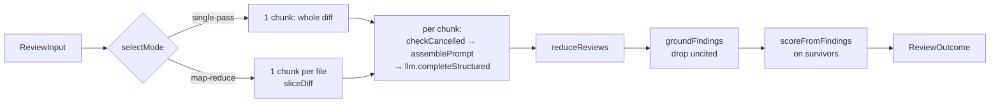

# Review pipeline, step by step

`reviewPullRequest` (`src/review/run.ts:123`) is the engine's single entry
point: diff + resolved agent inputs + an injected `LLMProvider` → a grounded
`Review`. The short overview and the public API list are in
[`../README.md`](../README.md). This page covers the details that shape
results.

## 1. Mode selection

`selectMode` (`src/review/run.ts:115`):

| `strategy` | Result |
| --- | --- |
| `single-pass` | always one call |
| `map-reduce` | one call per file, **unless the diff has only 1 file** |
| `auto` (default) | map-reduce only when changed lines (`additions + deletions`) exceed `mapThresholdLines` (default `DEFAULT_MAP_THRESHOLD_LINES = 400`) **and** there is more than one file |

The server passes the agent's `strategy`, falling back to the studio default
`REVIEW_STRATEGY` (`server/src/modules/reviews/run-executor.ts:191`).

## 2. Per-chunk loop

For each chunk (`run.ts:162`):

1. `input.checkCancelled?.()` runs **before** the LLM call. The engine doesn't
   own an error type: the caller's function throws (the server throws
   `RunCancelledError`). A call that has already started is not interrupted.
2. `assemblePrompt({ ...promptParts, diff: chunk.diffText })`. The optional
   slots (`skills`, `memory`, `specs`, `callers`, `repoMap`, `prDescription`)
   are the same for every chunk; only the diff changes.
3. `llm.completeStructured<Review>` with the shared `Review` Zod schema and
   `maxRetries` (default `DEFAULT_REVIEW_MAX_RETRIES = 2` reprompts).
4. Tokens and cost are added up (see
   [`llm-provider-and-cost.md`](llm-provider-and-cost.md)).

The prompt saved in the trace (`assembly`) is the **real** prompt in
single-pass mode. In map-reduce mode it is a whole-diff assembly built only
for display (`run.ts:142`); no single LLM call used exactly that prompt.

## 3. Reduce

`reduceReviews` (`src/review/reduce.ts:43`) concatenates findings, takes the
**worst** verdict, averages the partial scores and joins the summaries. That
averaged score is thrown away in step 5.

## 4. Grounding gate (mandatory)

`groundFindings` (`src/grounding.ts:52`) builds an index of new-side line
numbers per file from the diff hunks and keeps a finding only if:

- its `file` is in the diff (otherwise it is dropped with the reason "file … not present in diff"), and
- the range `start_line..end_line` hits at least one hunk line (otherwise it is dropped with "lines … do not intersect any diff hunk").

Dropped findings and their reasons are sent as `info` events and returned in
`outcome.dropped`. `groundingSummary` produces strings like `"3/4 passed"`.

## 5. Deterministic score

`scoreFromFindings` (`src/review/reduce.ts:27`) runs on the **surviving**
findings only: `100 − Σ penalty`, clamped to 0–100, with CRITICAL 35,
WARNING 12, SUGGESTION 3. The model's own `score` is never used, so the number
on screen always matches the findings list.

## Events

`onEvent` receives `{ kind, msg, data? }` in this order: mode (`info`) → per
chunk `tool` then `result` → reduce `result` → one `info` per grounding drop →
grounding `result`. The server forwards them to the SSE bus, and they end up
in the persisted run log.

## Testing

`npm test` uses a stubbed `LLMProvider`. `test/run.test.ts` covers
single-pass grounding (a hallucinated finding is dropped), the deterministic
score, cancellation before the LLM call, map-reduce token and cost summing
(including the one-unpriced-chunk case), and `sessionId` forwarding. The
`auto` threshold itself has no dedicated test.
