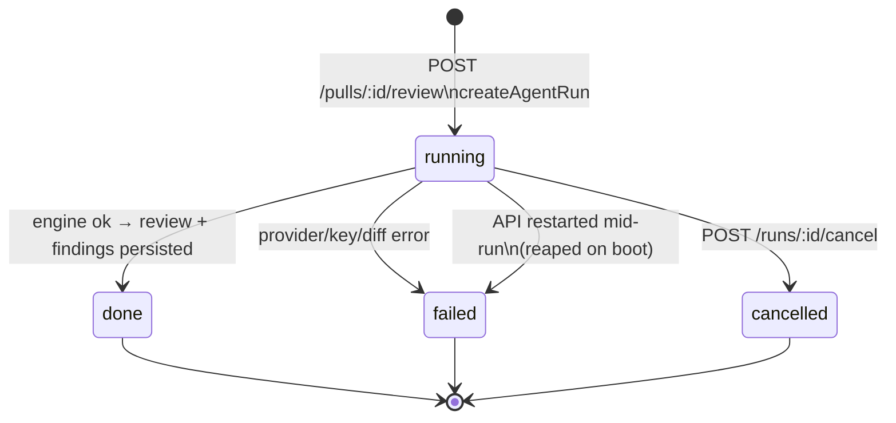

# Review run lifecycle and cost

How one agent review goes from a click to a persisted row, and where its cost
is recorded and rolled up. API shapes are in [`../README.md`](../README.md);
the engine internals are in
[`reviewer-core/docs/review-pipeline.md`](../../reviewer-core/docs/review-pipeline.md).

## Lifecycle

1. **Start.** `ReviewService.runReview` creates one `agent_runs` row per target
   agent with `status='running'` *before* any work
   (`src/modules/reviews/service.ts:120`, `repository/run.repo.ts:139`), so the
   HTTP response carries run ids the client can subscribe to right away.
2. **Background execution.** The executor is fired without `await`
   (`service.ts:133`). Shared pre-work (diff load) runs once. If it fails,
   `failAll` fails every queued run (`src/modules/reviews/run-executor.ts:75`).
3. **Per agent** (`runOneAgent`): resolve the provider (a missing key throws
   here and becomes a failed run), build the optional repo-intel context, then
   call `reviewPullRequest` from `@devdigest/reviewer-core` (`run-executor.ts:191`).
4. **Persist on success**, in this order: `insertReview` + `insertFindings`
   (`:219`), `markReviewed(headSha)` (`:235`), blockers counted
   deterministically with `countBlockers` (`:241`), `completeAgentRun` with
   `status='done'` (`:244`), then one `run_traces` JSON document (`:289`), and
   finally `runBus.complete` (`:290`) closes the SSE stream.
5. **Failure or cancel** (`run-executor.ts:293`): status becomes `failed` or
   `cancelled`, the error text and the log so far are saved as the trace, and
   `costUsd` is written as `null`.

### Live events and cancellation

- Events go through the in-memory `RunBus` (`src/platform/sse.ts:19`).
  `GET /runs/:id/events` replays the buffer, then streams live. The same buffer
  becomes the trace's `log`, so a reload shows what the stream showed.
- `cancelRun` does two things (`service.ts:85`): it signals the bus, and it
  sets the DB row to `cancelled` immediately (`run.repo.ts:116`). The DB write
  is what makes cancel work for orphaned runs that have no live process.
- The engine only checks for cancellation **before each LLM call**. A call that
  is already in flight finishes, and its tokens are spent.

### Orphaned runs

`reapStaleRunningRuns` (`run.repo.ts:127`) marks every `running` row as
`failed`. It is awaited in `src/app.ts:81` **before** the server listens, so
it cannot reap a run created by this process. It assumes a single API
instance per database.

## Cost

| Where | Value | Source |
| --- | --- | --- |
| `agent_runs.cost_usd` | USD for one run; `null` when unknown | `src/db/schema/runs.ts`, set by `completeAgentRun` (`run.repo.ts:164`) |
| Trace `stats.cost_usd` | same number, copied into the trace | `run-executor.ts:270` |
| `GET /pulls/:id/runs` | per-run `cost_usd` (Timeline) | `run.repo.ts:45` |
| `GET /pulls/:id/reviews` | per-review `cost_usd`, joined through `reviews.run_id` | `repository/review.repo.ts:95`, `helpers.ts:78` |
| `GET /repos/:id/pulls` | **total** per PR | `src/modules/pulls/routes.ts:160` |

The engine computes the number (see
[`llm-provider-and-cost.md`](../../reviewer-core/docs/llm-provider-and-cost.md)).
The server never re-prices a finished run; it stores what the engine returned.

### PR list total

`sumRunCosts` (`src/modules/pulls/cost.ts`) folds rows already filtered to
`status='done'` (`routes.ts:166`):

- Runs with `cost_usd = null` are **skipped**, so they don't turn the whole sum
  into `null`.
- A PR with no known cost at all is missing from the map, so the route returns
  `null` and the UI shows "—", never `$0`.

### Things that surprise people

- **A cancelled or failed run always has `null` cost**, even if one or more LLM
  calls were already paid for. The PR total can therefore undercount real spend.
- **Deleting a review keeps its run.** `DELETE /reviews/:id` removes only the
  review, so that run's cost still counts in the PR list total.
  `DELETE /runs/:id` removes the run *and* its review (`run.repo.ts:100`).
- Runs from before the `cost_usd` column existed (migration `0010`) are `null`,
  and older trace documents have no `stats.cost_usd` key at all. The contract
  uses `.nullish()` for that reason.
