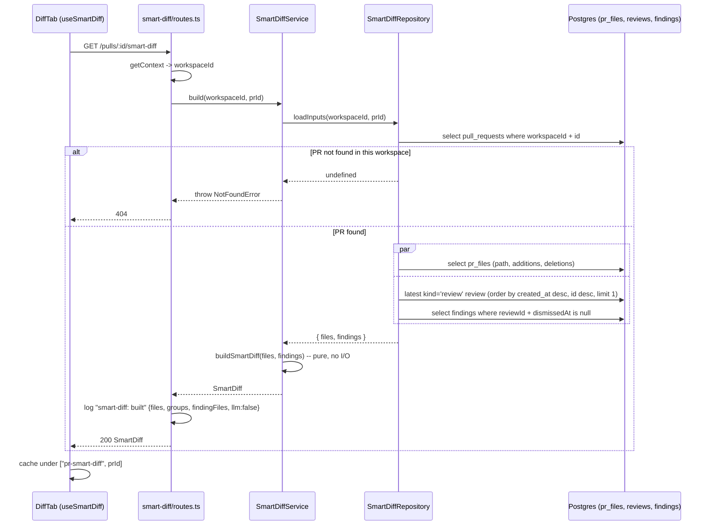

# Smart Diff (L03): grouping the diff by role and surfacing review findings

Groups a PR's files by role (`core → tests → wiring → docs → boilerplate`) and
attaches the latest review's kept findings to each file, so the **Files
changed** tab can show what the reviewer flagged without a trip to the Agent
runs tab. Request/response shapes are in [`../README.md`](../README.md) ("API
map"); the contract is `SmartDiff` in `@devdigest/shared`
(`src/vendor/shared/contracts/brief.ts`). Module code lives in
`src/modules/smart-diff/{constants,classify,domain,repository,service,routes}.ts`.

## Classification: check order vs. display order

Every PR file is classified once by `classifyFile(path)`
(`src/modules/smart-diff/classify.ts:11-17`): it normalises `\` to `/`, then
walks `CLASSIFICATION_RULES` (`constants.ts:27-75`) top to bottom and returns
the first matching role, or `core` when nothing matches.

The **check order** and the **display order** are deliberately different
(`constants.ts:9`, `:17-26`):

| | Order | Why |
| --- | --- | --- |
| Check order (`CLASSIFICATION_RULES`) | `boilerplate → tests → wiring → docs`, `core` fallback | A path can match more than one role's pattern; the more specific rule must win before a looser one (e.g. `docs`, which matches almost any `.md`) gets a chance. |
| Display order (`ROLE_ORDER`, `constants.ts:9`) | `core → tests → wiring → docs → boilerplate` | Puts business logic first for the reviewer; unrelated to which rule matched. |

Three disputed cases pin the check order as a deliberate decision, each
covered by a case in `server/test/smart-diff-classify.test.ts:59-67`:

- `src/__tests__/__snapshots__/x.snap` → `boilerplate`. The snapshot rule
  (`/(^|\/)__snapshots__\//`, `constants.ts:38`) is checked before the tests
  rule, so a snapshot inside a `__tests__` directory doesn't get classified as
  a test.
- `.claude/skills/security/SKILL.md` → `wiring`. The `.claude/**` rule
  (`constants.ts:67`) is checked before the docs `.md` rule — this markdown
  defines agent behavior, not documentation.
- `e2e/README.md` → `tests`. The `e2e/**` rule (`constants.ts:53`) is checked
  before the docs rule. This is the starter default, kept as-is: an e2e
  README still reads as part of the test suite (`classify.test.ts:65-67`).

## `buildSmartDiff`: pure grouping

`buildSmartDiff(files, findings)` (`src/modules/smart-diff/domain.ts:26-59`)
takes the PR's files (`path`, `additions`, `deletions`) and the caller's
already-filtered findings (`file`, `start_line`), and:

1. Indexes findings by `file` into a `Set<number>` of `start_line` values
   (`domain.ts:27-32`), so `finding_lines` come out unique.
2. Classifies each file with `classifyFile` and buckets it by role, keeping
   the input (GitHub) order inside each bucket (`domain.ts:35-47`).
3. Emits one `SmartDiffGroup` per role in `ROLE_ORDER`, **skipping roles with
   no files** — an empty group is never sent (`domain.ts:49-51`).
4. Fills `split_suggestion` minimally: `too_big: false`, `total_lines =
   Σ(additions + deletions)` over every file, `proposed_splits: []`
   (`domain.ts:53-58`). No real split analysis — out of scope for this
   lesson.

`buildSmartDiff` and `classifyFile` import nothing but `constants.ts` and the
shared `SmartDiff*` types — no DB, no HTTP, no LLM. That is intentional: the
plan (`docs/plans/smart-diff-plan.md`, "Key design decisions") calls this out
explicitly so a later lesson (L08) can import `classifyFile` as a filter
before prompt assembly, without spinning up a route
(`classify.ts:4-10`).

## Route

`GET /pulls/:id/smart-diff` (`src/modules/smart-diff/routes.ts:16-33`):

- `params: IdParams`, `response: { 200: SmartDiffResponse }` — both Zod
  schemas from `@devdigest/shared`.
- Resolves `workspaceId` via `getContext` (`routes.ts:20`), then calls
  `container.smartDiffService.build(workspaceId, req.params.id)`
  (`routes.ts:21`).
- `SmartDiffService.build` (`service.ts:36-40`) asks the port for
  `loadInputs(workspaceId, prId)` and throws `NotFoundError` (→ 404) when the
  PR isn't in this workspace; otherwise it hands the files and findings to the
  pure `buildSmartDiff`.
- Logs `smart-diff: built` with `{prId, files, groups, findingFiles, llm:
  false}` before returning (`routes.ts:22-30`) — `files` and `findingFiles`
  are recomputed from the response so the log backs the "no model call" claim
  independently of what the domain function returned.

### Why no LLM call

Classification is a pure, path-based regex match (`classify.ts:11-17`) —
there is nothing for a model to infer here that the file path doesn't already
say. The route's `llm: false` field in its `smart-diff: built` log line
(`routes.ts:27-30`) exists specifically to make that verifiable from the
server logs, not just from reading the code.

### Data source: `SmartDiffRepository.loadInputs`

`SmartDiffRepository` (`src/modules/smart-diff/repository.ts`) implements the
single-method `SmartDiffSourcePort` the service depends on
(`service.ts:24-27`). One workspace-scoped call, modeled on
`IntentRepository.loadInputs`, so tenancy can't be bypassed by calling the
files or findings query without checking the PR first
(`repository.ts:15-20`):

1. `loadInputs(workspaceId, prId)` (`repository.ts:21-33`) first checks the PR
   belongs to `workspaceId` (`t.pullRequests.workspaceId` + `.id`,
   `repository.ts:22-25`); returns `undefined` immediately if not, which the
   service turns into 404.
2. In parallel (`Promise.all`, `repository.ts:28-31`):
   - `getPrFiles(prId)` (`repository.ts:38-43`) selects `path`, `additions`,
     `deletions` from `pr_files` in their stored (insertion) order — `pr_files.id`
     is a random UUID, so it can't recover GitHub order, and no `ORDER BY` is
     added.
   - `latestReviewFindings(workspaceId, prId)` (`repository.ts:50-70`) finds
     the newest `kind='review'` review for this PR — `ORDER BY created_at
     DESC, id DESC LIMIT 1` (`repository.ts:54-62`), so ties on `created_at`
     resolve deterministically — then selects `file`, `startLine` from
     `findings` for that review where `dismissed_at IS NULL`
     (`repository.ts:65-68`). Returns `[]` before the first review, or if
     every finding was dismissed.

> Plan/code difference: the plan's "Key design decisions" section
> (`docs/plans/smart-diff-plan.md:33-36`) describes the port as three separate
> methods (`getPull`, `getPrFiles`, `latestReviewFindings`). The implemented
> port is the single `loadInputs(workspaceId, prId)` described above — the
> plan's own Phase 5 (S5, `smart-diff-plan.md:110`) already points at this
> shape ("copies the `IntentRepository.loadInputs` pattern... workspace-scoped
> `loadInputs`"), so the code matches the later, more specific instruction.

## Sequence

## Wiring

- `Container.smartDiffRepo` / `Container.smartDiffService` are lazy getters
  (`src/platform/container.ts:139-146`); the service takes only the narrow
  `{ source: SmartDiffSourcePort }` shape, not the whole container.
- The route module is registered once in `src/modules/index.ts:13,40`, same
  pattern as every other feature module.

## Tests

- `server/test/smart-diff-classify.test.ts` — the "path → role" table for
  `classifyFile`, one case per pattern plus the three disputed cases above.
- `server/test/smart-diff-domain.test.ts` — `buildSmartDiff`: role order and
  empty-group omission, input order preserved inside a group, unique/sorted
  `finding_lines`, `total_lines` sum, output passes `SmartDiff.parse`.
- `server/test/smart-diff-service.test.ts` — hermetic, fake
  `SmartDiffSourcePort`: 404 for an unknown PR and for a PR in a different
  workspace, empty `finding_lines` everywhere before the first review.
- `server/test/smart-diff.it.test.ts` — DB-backed (testcontainers), against
  seeded PR #482: `SmartDiff.safeParse` succeeds, `src/config.ts` picks up
  line 12 from the review, a dismissed finding at `src/api/users.ts:45` is
  excluded, a newer `kind='review'` review supersedes the seeded one, and a
  cross-workspace PR 404s.

## Client (brief)

See [`../../client/docs/data-flow.md`](../../client/docs/data-flow.md) for
the full query-key/invalidation picture. In short:

- Group roles, order, group file-counters and the file-card dot all come from
  this route's response, fetched by `useSmartDiff(prId, enabled)`
  (`client/src/lib/hooks/smart-diff.ts:17-23`), cached under
  `["pr-smart-diff", prId]`.
- The inline finding cards under a code line come from a separate source:
  `usePrReviews(prId)` plus the client-side `latestReviewFindings`/
  `findingsByPath` helpers
  (`client/src/app/repos/[repoId]/pulls/[number]/_components/DiffTab/helpers.ts:12-37`),
  which apply the same "newest `kind='review'`, dismissed excluded" rule as
  `latestReviewFindings` above, so both views agree on which review wins.
- `DiffTab` falls back to Original order whenever Smart Diff is loading,
  errored, or the PR's files haven't loaded yet
  (`DiffTab.tsx:39-41`).
